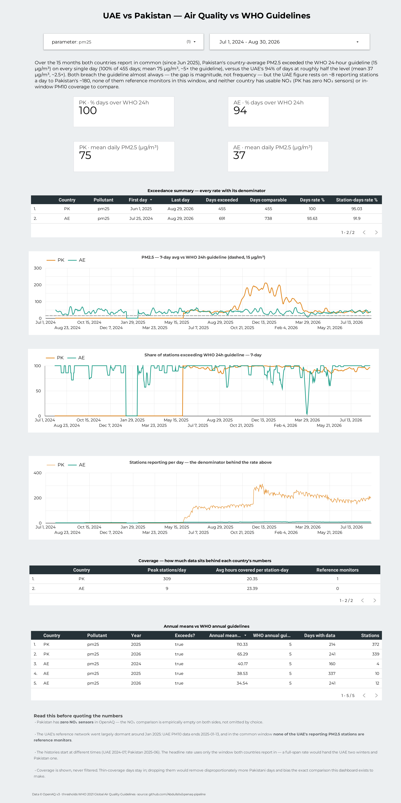
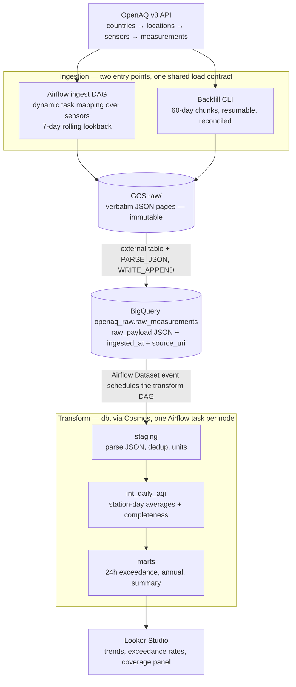

# openaq-pipeline

Batch data engineering pipeline ingesting air-quality data from the OpenAQ v3
API, comparing the UAE and Pakistan on PM2.5 / PM10 / NO2 against WHO 2021
guidelines. The cross-country data-quality gap is itself an intended finding.

**Status:** complete (Phases 0–7). Repo hygiene + CI/CD, GCP infrastructure via
Terraform, a tested OpenAQ v3 ingestion client, an Airflow ingest DAG (dynamic
task mapping over sensors, 7-day rolling lookback) loading verbatim raw JSON
into BigQuery, a dbt ELT layer (staging → daily aggregates → WHO-exceedance
marts) run by astronomer-cosmos as per-model Airflow tasks on a
Dataset-triggered transform DAG, a backfilled history (1.8M measurements: AE
from 2024-07, PK from 2025-06 — spans chosen from sensor metadata, every chunk
count-reconciled, gaps audited and classified), observability via dbt source
freshness + Elementary, and a live Looker Studio dashboard.

## The finding

Over the 15 months the UAE and Pakistan report in common (since Jun 2025),
Pakistan's country-average PM2.5 exceeded the WHO 24-hour guideline (15 µg/m³)
on **every single day** — 100% of 455 days, mean 75 µg/m³, ~5× the guideline —
versus the UAE's **94%** of days at roughly half the level (mean 37 µg/m³,
~2.5×). Both breach the guideline almost always; the gap is magnitude, not
frequency. The caveat is the point of the project: the UAE figure rests on ~8
reporting stations a day against Pakistan's ~180, none of the UAE's PM2.5
stations are reference monitors in this window, and neither country has usable
NO₂ (Pakistan has zero NO₂ sensors) or in-window PM10 coverage to compare.

*Figures as of data through 2026-08-29. The dashboard is live against the
marts and moves daily.*

**Dashboard:** [UAE vs Pakistan — Air Quality vs WHO Guidelines](https://datastudio.google.com/reporting/7c88238c-c153-4c64-bf5b-c1974f859158/page/9Fj4F)
· spec and snapshot in [`looker/`](looker/)

The dashboard reads BigQuery live, so it depends on the GCP project behind it.
The snapshot below, the spec, and the mart exports in [`data/`](data/) are
version-controlled precisely so the result outlives that dependency — the
finding above can be checked against `data/marts/mart_exceedance_summary.csv`
with no cloud account at all.

[](https://datastudio.google.com/reporting/7c88238c-c153-4c64-bf5b-c1974f859158/page/9Fj4F)

## Architecture



Both ingestion paths write through the same GCS object-naming contract and the
same BigQuery load code (`ingestion/openaq/bq_load.py`), so the daily and
backfill paths cannot drift apart. Raw JSON is never parsed at load time —
typing happens in dbt, so an upstream schema change breaks a model you can fix
and re-run, not an ingest you have to re-land.

## What this is, and what it isn't

The dataset is a few hundred MB over two years. Airflow + GCS + BigQuery + dbt
+ Looker is **deliberate over-engineering** — a single Postgres instance would
handle this comfortably. The stack exists to demonstrate production data
engineering patterns end-to-end at small scale, and the project documents where
each pattern would break at real scale rather than pretending the scale
requirement exists. It is a portfolio and learning project, not a production
service: it runs on one laptop's Docker Compose, and nothing pages anyone when
it stops (see [`docs/runbook.md`](docs/runbook.md)).

The engineering decisions that shaped it — and the reasoning behind each — are
in `docs/PROJECT_CONTEXT.md` §4 as twelve numbered guardrails.

## Stack

| Layer | Tool |
|---|---|
| Ingestion | Python 3.12 → OpenAQ v3 API (sensor-centric fan-out) |
| Raw storage | GCP Cloud Storage (verbatim JSON) |
| Warehouse | BigQuery |
| Transformation | dbt 1.8 (staging → intermediate → mart) |
| Orchestration | Apache Airflow 2.9.1 (Docker Compose, LocalExecutor) |
| dbt-in-Airflow | astronomer-cosmos (one task per dbt node) |
| Observability | dbt source freshness + Elementary |
| IaC | Terraform 1.15 |
| Dashboard | Looker Studio |

## Repository layout

```
.
├── airflow/        Airflow Docker image + the openaq_ingest / openaq_transform DAGs
├── dbt/            dbt project: staging/intermediate/mart models + WHO-thresholds seed
├── ingestion/      OpenAQ v3 client (fan-out to GCS raw) + WHO threshold constants
├── infra/          Terraform IaC for GCP (bucket, datasets, service account)
├── scripts/        Dev utility scripts (bootstrap)
├── tests/          Pytest suite (unit + DAG integrity + live integration test)
├── docs/           PROJECT_CONTEXT.md (source of truth), architecture, runbook
├── looker/         Dashboard spec + snapshot (Looker Studio has no report export)
└── data/           Mart exports — the finding, verifiable without a cloud account
```

Every directory has its own README describing what's in it and why.

---

# Running it

There are two levels. **Level 1** verifies the code and needs nothing but
Python. **Level 2** runs the actual pipeline and needs your own GCP project and
an OpenAQ API key — there is no shared sandbox to point you at.

## Level 1 — verify the code (~2 minutes, no cloud account)

```bash
git clone https://github.com/Abdulla1x/openaq-pipeline.git
cd openaq-pipeline
```

The project targets **Python 3.12** — the version CI and the Airflow image use.
Don't assume you have it: on many systems `python3` is something newer, and
there may be no `python3.12` binary at all. The reliable route is
[uv](https://docs.astral.sh/uv/), which fetches the interpreter itself:

```bash
curl -LsSf https://astral.sh/uv/install.sh | sh     # if you don't have uv
uv venv --python 3.12 .venv
uv pip install -e . -r requirements-dev.txt
```

If `python3 --version` already reports 3.12, the standard library works too:

```bash
python3 -m venv .venv
.venv/bin/pip install -e . -r requirements-dev.txt
```

Either way:

```bash
.venv/bin/python -m pytest tests/unit/ -v                 # 44 tests, ~1s
.venv/bin/ruff check . && .venv/bin/sqlfluff lint dbt/models dbt/analyses
```

(With the venv on your `PATH`, those two are exactly `make test` and
`make lint`.)

This exercises the OpenAQ client's auth, throttling, retry and pagination
behaviour, the backfill chunk math and checkpoint/resume logic, the raw-zone
object-naming contract, and the WHO threshold values — all against a mocked
API, so it needs no network and no credentials. It validates the **code**, not
the pipeline; nothing here talks to GCP.

The same checks run on every pull request, along with `dbt parse`,
`terraform validate`, and a DAG-integrity job that installs Airflow under the
official constraints and imports both DAGs. All five are required by branch
protection on `main`.

## Level 2 — run the pipeline

### Prerequisites

| Need | Why |
|---|---|
| Docker + Docker Compose | Runs Airflow (webserver, scheduler, Postgres) |
| Terraform ≥ 1.15 | Provisions every GCP resource — nothing is clicked by hand |
| Python 3.12 | Matches the Airflow image and CI exactly |
| Google Cloud SDK (`gcloud`, `gsutil`, `bq`) | State bucket, service-account key, ad-hoc queries |
| A GCP project with billing enabled | BigQuery and GCS both need it |
| An OpenAQ API key | Free, from [explore.openaq.org](https://explore.openaq.org) |

Cost: this fits inside BigQuery's free tier (10 GB storage / 1 TB queried per
month). A full dbt refresh scans roughly 1 GB, so even a daily rebuild is about
31 GB/month. GCS storage of the raw zone is a few hundred MB.

### 1. Provision GCP

The bucket that holds Terraform's remote state can't be created by the state it
stores, so it's bootstrapped once by hand. **[`infra/README.md`](infra/README.md)
has the exact commands** — create the state bucket, then set its literal name in
the `backend "gcs"` block in `infra/main.tf` (Terraform backend blocks cannot
read variables).

```bash
cd infra
cp terraform.tfvars.example terraform.tfvars     # fill in project_id
terraform init && terraform apply                # 11 resources
cd ..
```

This creates the raw bucket, the `openaq_raw` / `openaq_dbt` /
`openaq_dbt_elementary` datasets, and a least-privilege service account. Run
`terraform apply` twice — the second must report "No changes."

Then create the service-account key with gcloud (**not** Terraform — a
`google_service_account_key` resource writes the private key into state in
plaintext); `infra/README.md` has that command too. Keep it outside the repo.

### 2. Configure

```bash
bash scripts/bootstrap.sh     # checks tools, creates .env from the template
```

Then fill in `.env`. Four values need real attention:

- **`GCP_KEY_FILE`** — the host path to the key you just created. Docker Compose
  bind-mounts it and **refuses to start without it**; there is no default.
- **`GOOGLE_APPLICATION_CREDENTIALS`** — the same path, used by CLI runs outside
  the containers. (Inside the containers it is deliberately a *different*,
  fixed path — the mount target.)
- **`AIRFLOW__CORE__FERNET_KEY`** — generate one; the compose fallback is a
  placeholder, not a valid key:
  ```bash
  python3 -c "from cryptography.fernet import Fernet; print(Fernet.generate_key().decode())"
  ```
- **`BIGQUERY_LOCATION`** — must equal the region your datasets are in
  (`us-central1` by default). BigQuery jobs run in exactly one location, and a
  mismatch fails as a confusing "dataset not found".

`bootstrap.sh` sets `AIRFLOW_UID` to your own uid so files the containers write
into `logs/` aren't owned by a stranger uid on your host.

### 3. Start Airflow

```bash
make up          # http://localhost:8080 — admin / admin
```

**Unpause `openaq_ingest` in the UI.** DAGs are created paused, so until you do,
nothing happens and it looks like the stack is broken.

The DAG runs daily at 02:00 UTC for the previous complete UTC day. Per country
it lands the locations inventory, fans out one dynamically-mapped task per
sensor behind a 4-slot pool (the API allows 60 requests/minute), loads the
landed pages into BigQuery, and reconciles the count it loaded against the count
the API served.

Two things that look like failures and aren't:

- **A green run with failed sensors.** Roughly 30–60 Pakistani sensors return
  HTTP 500 on every request — a persistent upstream bug, not a transient one.
  Per-sensor failures are collected as data; a country fails only above 20%. If
  a handful of permanently broken sensors turned the DAG red, "failed DAG" would
  stop meaning anything.
- **Most sensors returning nothing.** On a typical day only ~8 of the UAE's 52
  target sensors report at all. Empty responses are counted and skipped. That
  sparseness is the finding, not a bug.

### 4. Load history

The daily DAG only ever covers a 7-day window. History is a separate, explicit
step:

```bash
set -a && source .env && set +a
python -m ingestion.openaq backfill --country AE --start 2024-07-01
python -m ingestion.openaq backfill --country PK --start 2025-06-01 \
    --skip-sensors-csv dbt/seeds/known_bad_sensors.csv
```

Roughly 3 hours for both countries, rate-limit bound. It runs in 60-day chunks,
count-reconciles each chunk against the API before checkpointing it, and skips
completed chunks on re-run — interrupt it freely. Start dates come from what
actually exists upstream (`ingestion/README.md` explains the choice); asking for
earlier data returns nothing.

### 5. Transform and serve

Nothing to trigger. Each successful load emits an Airflow Dataset event, which
schedules `openaq_transform`; Cosmos renders the dbt project as one Airflow task
per node, so a failing model retries alone and its tests gate the models
downstream of it.

Then point Looker Studio at the `openaq_dbt` dataset using the native BigQuery
connector. [`looker/dashboard_spec.md`](looker/dashboard_spec.md) is a
build-by-hand spec of every chart, metric, and control — Looker Studio has no
report-as-JSON export, so the spec is the version-controlled artifact.

## Operating it

[**`docs/runbook.md`**](docs/runbook.md) covers day-to-day operation: checking
data freshness, recovering from an outage longer than the lookback window can
heal, reading a partially-failed run, and the failure modes this project has
actually hit.

## Documentation

- **[`docs/PROJECT_CONTEXT.md`](docs/PROJECT_CONTEXT.md)** — the living source of
  truth: twelve architectural guardrails with the reasoning behind each, the
  phase roadmap with verified exit criteria, and a log of everything that turned
  out to be different from the plan.
- **[`docs/architecture.md`](docs/architecture.md)** — short-form overview.
- **[`docs/runbook.md`](docs/runbook.md)** — operations.

## License

MIT — see [`LICENSE`](LICENSE).
